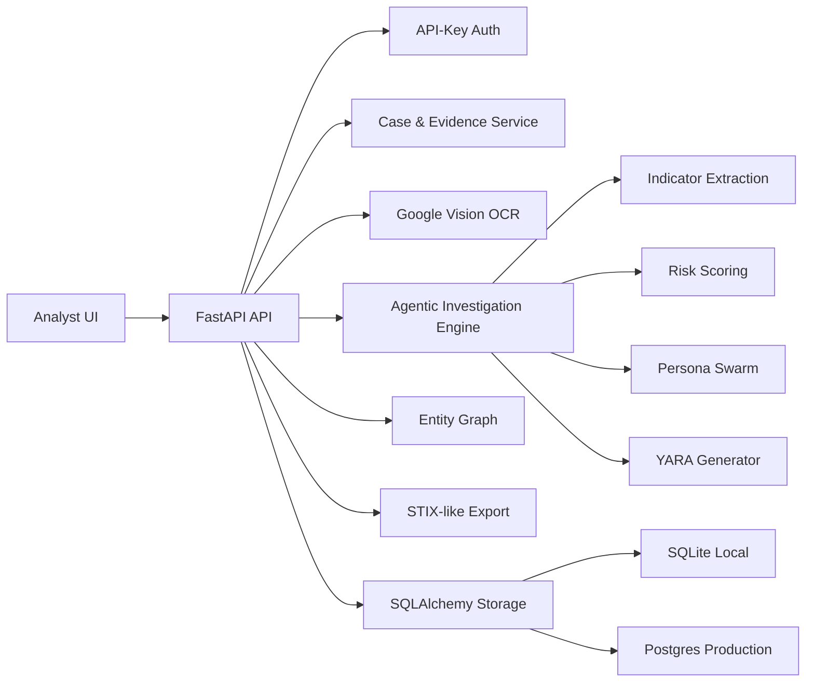

# Darkweb Monitoring - Agentic AI

An enterprise-ready defensive threat-intelligence platform for turning noisy dark-web mentions into scoped investigations, case records, evidence, entity graphs, and detection content.

The product is based on the attached Google Threat Intelligence-style workflow: start from noisy underground shell-sale mentions, scope the investigation, pivot across actor/technical/financial paths, generate YARA detections, and preserve analyst-grade reporting. It also includes Google Cloud Vision OCR support for screenshots/scanned evidence and a clean-room MiroFish-inspired persona swarm for multi-perspective analysis.

## Current Status

This repository contains a working production baseline:

- FastAPI backend
- Browser-based analyst console
- Agentic investigation engine
- Case management
- Evidence storage
- SQLite local storage
- Postgres-ready SQLAlchemy storage
- Google Cloud Vision OCR endpoint
- YARA rule generation
- Entity graph generation
- STIX-like export
- Connector registry for GTI, MISP, OpenCTI, and SIEM integrations
- API-key auth hooks
- Docker and Docker Compose
- GitHub Actions CI
- Unit and API tests
- Comprehensive PRD in [docs/PRD.md](docs/PRD.md)

## Key Capabilities

### Agentic Investigation

- Accepts raw intelligence text, analyst notes, OCR output, or threat-feed snippets.
- Extracts domains, actor handles, crypto addresses, technologies, shell families, obfuscation markers, and persistence indicators.
- Scores risk from 0-100 using evidence and organization context.
- Produces executive summaries, analyst findings, pivots, next actions, and detection rules.

### Case Management

- Create and update investigation cases.
- Track status: `draft`, `triaged`, `escalated`, `closed`.
- Track owner, severity, tags, linked evidence, and linked investigations.
- Attach generated investigation reports to cases.

### Evidence Handling

- Store evidence records independently or under a case.
- Use manual snippets, screenshots converted through OCR, source references, or telemetry extracts.
- Preserve evidence metadata for audit and analyst traceability.

### Detection Engineering

- Generates YARA rules for:
  - B374K PHP web shell
  - WSO PHP web shell
  - Generic obfuscated PHP web shell behavior
- Includes rationale with each rule.
- Designed for validation before deployment to Livehunt, Retrohunt, EDR, or malware repositories.

### Google Cloud Vision OCR

- Optional OCR endpoint for image evidence.
- Supports analyst workflows involving screenshots, scanned documents, chat captures, or source images.
- Returns clear configuration errors when Vision credentials are not enabled.

### Graph Intelligence

- Builds an investigation graph from reports and indicators.
- Creates nodes for investigations and indicators.
- Creates confidence-scored edges for indicator mentions.
- Provides a foundation for later Neo4j/OpenCTI graph expansion.

### Integration Boundaries

The repo includes connector-ready boundaries for:

- Google Threat Intelligence
- MISP
- OpenCTI
- SIEM platforms such as Splunk, Chronicle, Microsoft Sentinel, and Elastic

Live third-party pushes are intentionally not hard-coded. Production teams can add sanctioned credentials and API clients inside these boundaries.

## Safety Boundaries

This product is defensive tooling only.

It is designed for:

- Analyst-provided evidence
- Licensed threat-intelligence exports
- Internal telemetry
- Approved OCR evidence
- Sanctioned investigations
- Defensive detection engineering

It does not include:

- Unauthorized crawling
- Exploit execution
- Credential theft
- Dark-web purchasing workflows
- Account compromise
- Malware deployment

## Architecture



## Repository Layout

```text
.
├── darkweb_monitoring/
│   ├── agents.py            # Agentic analysis, extraction, risk scoring, pivots
│   ├── config.py            # Environment settings
│   ├── connectors.py        # GTI/MISP/OpenCTI/SIEM connector registry and exports
│   ├── google_vision.py     # Google Cloud Vision OCR client
│   ├── graph.py             # Entity graph builder
│   ├── main.py              # FastAPI application and routes
│   ├── models.py            # Pydantic models
│   ├── security.py          # API-key auth and role checks
│   ├── storage.py           # SQLAlchemy storage layer
│   └── yara.py              # YARA generation
├── docs/
│   └── PRD.md               # Comprehensive product requirements document
├── static/
│   ├── app.js               # Browser UI behavior
│   ├── index.html           # Analyst console
│   └── styles.css           # UI styling
├── tests/
│   ├── test_agents.py
│   └── test_api.py
├── Dockerfile
├── docker-compose.yml
├── Makefile
├── pyproject.toml
└── README.md
```

## Quick Start

```bash
cp .env.example .env
python3 -m venv .venv
. .venv/bin/activate
pip install -e ".[dev]"
uvicorn darkweb_monitoring.main:app --reload --host 0.0.0.0 --port 8000
```

Open:

```text
http://localhost:8000
```

API docs:

```text
http://localhost:8000/docs
```

## Docker Compose

Docker Compose starts the app with Postgres:

```bash
cp .env.example .env
docker compose up --build
```

Default app URL:

```text
http://localhost:8000
```

Default Postgres URL inside Compose:

```text
postgresql+psycopg://darkweb:darkweb_dev_password@db:5432/darkweb_monitoring
```

## Environment Variables

| Variable | Purpose | Default |
| --- | --- | --- |
| `APP_ENV` | Runtime environment | `development` |
| `DATABASE_URL` | SQLAlchemy database URL | `sqlite:///./darkweb_monitoring.sqlite3` |
| `ALLOWED_ORIGINS` | CORS allow-list | `http://localhost:8000,http://127.0.0.1:8000` |
| `AUTH_ENABLED` | Require API keys when `true` | `false` |
| `API_KEYS` | Comma-separated analyst keys | `local-dev-key` |
| `ADMIN_API_KEYS` | Comma-separated admin keys | `local-admin-key` |
| `VISION_OCR_ENABLED` | Enable Google Vision OCR | `false` |
| `GOOGLE_APPLICATION_CREDENTIALS` | Service account JSON path | empty |
| `GOOGLE_CLOUD_PROJECT` | Google Cloud project ID | empty |
| `RETENTION_DAYS` | Evidence/report retention policy | `180` |

## API Examples

### Health

```bash
curl http://localhost:8000/api/health
```

### Create Investigation

```bash
curl -X POST http://localhost:8000/api/investigations \
  -H "Content-Type: application/json" \
  -d '{
    "title": "Shell Sales Analysis",
    "focus": "technical",
    "organization_profile": "Enterprise with public PHP and cPanel assets.",
    "seed_text": "Telegram seller @shellbroker advertises PHP shells, cPanel, SMTP, .gov/.edu targets, base64, .htaccess, cron, B374K and WSO.",
    "generate_yara": true,
    "run_swarm_simulation": true
  }'
```

### Create Case

```bash
curl -X POST http://localhost:8000/api/cases \
  -H "Content-Type: application/json" \
  -d '{
    "title": "Shell-sale monitoring case",
    "owner": "threat-intel",
    "severity": "high",
    "tags": ["webshell", "telegram"]
  }'
```

### Add Evidence

```bash
curl -X POST http://localhost:8000/api/cases/{case_id}/evidence \
  -H "Content-Type: application/json" \
  -d '{
    "title": "Telegram source snippet",
    "source_type": "manual",
    "content": "@broker advertises WSO PHP shells and cPanel access"
  }'
```

### Attach Investigation To Case

```bash
curl -X POST http://localhost:8000/api/cases/{case_id}/investigations/{report_id}
```

### Entity Graph

```bash
curl http://localhost:8000/api/graph
```

### Connector Registry

```bash
curl http://localhost:8000/api/connectors
```

### STIX-like Export

```bash
curl http://localhost:8000/api/investigations/{report_id}/exports/stix
```

### Google Vision OCR

First configure:

```bash
VISION_OCR_ENABLED=true
GOOGLE_APPLICATION_CREDENTIALS=/absolute/path/to/service-account.json
GOOGLE_CLOUD_PROJECT=your-project-id
```

Then call:

```bash
curl -F "file=@evidence.png" http://localhost:8000/api/vision/ocr
```

## Authentication

Local development has auth disabled by default.

To enable API-key auth:

```bash
AUTH_ENABLED=true
API_KEYS=analyst-key-1,analyst-key-2
ADMIN_API_KEYS=admin-key-1
```

Pass a key:

```bash
curl http://localhost:8000/api/cases -H "X-API-Key: analyst-key-1"
```

Admin-only endpoint example:

```bash
curl http://localhost:8000/api/admin/retention -H "X-API-Key: admin-key-1"
```

For enterprise production, put the service behind SSO or an identity-aware proxy. The built-in API-key layer is a deployable control, not a replacement for full enterprise IAM.

## Development

```bash
make install
make test
make lint
```

Equivalent commands:

```bash
python3 -m venv .venv
. .venv/bin/activate
pip install -e ".[dev]"
pytest -q
ruff check .
```

## Testing

The test suite covers:

- Indicator extraction
- Investigation generation
- YARA generation path
- API health
- Investigation API
- Case/evidence/graph/export flow
- Connector registry

Run:

```bash
pytest -q
```

## Production Deployment Guidance

For a real deployment:

- Use managed Postgres.
- Enable `AUTH_ENABLED=true`.
- Store API keys and Google credentials in a secrets manager.
- Run behind TLS and SSO.
- Add audit logging and request tracing.
- Configure database backups.
- Configure retention/deletion jobs based on `RETENTION_DAYS`.
- Validate YARA before enforcement.
- Connect only approved telemetry and intelligence sources.
- Review generated reports before external sharing.

## Roadmap

Near-term:

- Multi-file OCR ingestion
- PDF OCR pipeline
- Sigma rule generation
- Case comments and analyst activity feed
- CSV/STIX export downloads
- Better UI graph visualization

Mid-term:

- MISP push integration
- OpenCTI push integration
- SIEM alert forwarding
- Google Threat Intelligence enrichment adapter
- Detection validation pipeline
- Role-based UI controls

Long-term:

- Neo4j or graph database backend
- Full STIX/TAXII server
- MiroFish sidecar simulation adapter where licensing permits
- LLM-grounded reports with citations and analyst approval
- Enterprise SSO integration

## Public Tooling Notes

MiroFish is referenced as architectural inspiration for persona and scenario simulation. This repository implements a clean-room lightweight simulation layer and does not vendor MiroFish code.

Google Cloud Vision is supported through the official `google-cloud-vision` Python client.

## PRD

The full product requirements document is committed at:

[docs/PRD.md](docs/PRD.md)

