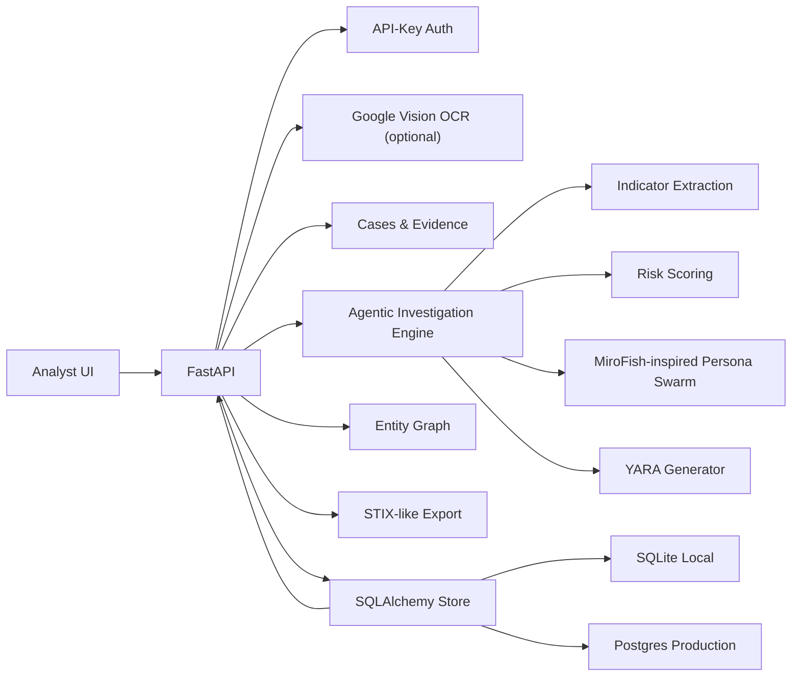

# Product Requirements Document: Darkweb Monitoring Agentic AI

## Document Control

- Product: Darkweb Monitoring - Agentic AI
- Version: 1.1
- Status: Implemented baseline with enterprise extensions
- Primary audience: SOC, threat intelligence, detection engineering, security leadership, platform engineering
- Repository: `mayanklau/Darkweb-monitoring.---Agentic-AI`

## Source Basis

The attached 8-page PDF describes a Google Threat Intelligence investigation pattern:

- Traditional monitoring creates noise and false positives.
- Agentic AI should sift large dark-web event streams and align underground activity to an organization's unique risk profile.
- The example investigation starts with shell sales in the last 30 days.
- Initial findings identify PHP shells and cPanel access promoted on Telegram, with high-value `.gov` and `.edu` targets.
- Investigation pivots split into actor research, technical payload analysis, and financial breadcrumbs.
- Technical analysis identifies B374K, WSO, Base64 obfuscation, `.htaccess` modification, and cron-job persistence.
- The workflow generates YARA rules and supports Livehunt/Retrohunt-style validation.
- The strategic direction is greater autonomy: context, intent, and defensive innovation.

Public tooling considered:

- MiroFish public GitHub project: multi-agent prediction engine using graph construction, persona generation, simulation, and report generation.
- Google Cloud Vision: OCR for screenshots and scanned evidence that analysts may receive from closed sources, chat captures, or documents.

## Product Vision

Build a defensive, agentic dark-web monitoring product that turns noisy underground mentions into validated, asset-relevant intelligence. The product must help analysts move from raw mention to scoped investigation, detection engineering, and executive-ready reporting.

## Problem Statement

Traditional dark-web monitoring often produces large volumes of keyword hits without enough context. Analysts then spend time manually removing false positives, finding pivots, determining asset relevance, and translating technical chatter into defensive action. The product solves this by combining deterministic extraction, organization-aware risk scoring, persona-style agentic analysis, case management, evidence handling, OCR, graph views, and detection generation in one workflow.

## Goals

- Reduce false positives by correlating underground mentions with organization context.
- Provide guided pivots across actor, technical, and financial paths.
- Generate immediately usable defensive artifacts such as YARA rules.
- Support OCR ingestion through Google Cloud Vision.
- Preserve reports, rationale, confidence, and evidence for audit.
- Provide a complete deployable baseline with API, UI, persistence, tests, CI, Docker, and documentation.
- Support enterprise pilot readiness through cases, evidence, Postgres, auth hooks, graph APIs, and export boundaries.

## Non-Goals

- No unauthorized crawling, purchasing, credential collection, exploit execution, or account compromise.
- No claim that generated YARA is production-final without validation.
- No hidden dependence on a proprietary threat-intelligence feed.
- No autonomous blocking, takedown, enforcement, or external sharing without analyst review.

## Personas

- SOC analyst: needs high-signal alerts and investigation summaries.
- Threat intelligence analyst: needs pivots, actor/channel timelines, source context, and confidence.
- Detection engineer: needs payload traits and YARA/hunting content.
- Risk owner: needs asset relevance, impact, and recommended owner action.
- Platform engineer: needs deployable services, configuration, health checks, auth hooks, and storage choices.

## Core User Stories

- As an analyst, I can paste raw dark-web text and receive a structured report.
- As an analyst, I can choose scoping, actor, technical, or financial focus.
- As a detection engineer, I can generate YARA rules for PHP shell families.
- As a threat intel analyst, I can see recommended pivots for handles, payloads, domains, and crypto addresses.
- As a user with image evidence, I can send screenshots to Google Cloud Vision OCR and feed the text into an investigation.
- As a manager, I can retrieve stored investigations and review risk scoring and recommendations.
- As a SOC lead, I can group investigations into cases and track status.
- As a platform engineer, I can run locally on SQLite and deploy with Postgres.
- As an integration owner, I can see which connector boundaries exist and export report data.

## Functional Requirements

1. Ingestion
   - Accept analyst-provided text through API and UI.
   - Accept image uploads through a Google Vision OCR endpoint when configured.
   - Reject OCR requests when credentials are not configured.

2. Indicator Extraction
   - Extract domains, high-value TLDs, handles, cryptocurrency addresses, shell families, obfuscation methods, persistence methods, and infrastructure tooling.
   - Assign confidence and evidence labels.

3. Agentic Analysis
   - Run a scoping agent to reduce noisy mentions into investigation themes.
   - Run an organization-context agent to align findings with business exposure.
   - Run a technical-analysis agent when payload or persistence traits appear.
   - Run a lightweight swarm simulation inspired by MiroFish persona-based analysis.

4. Risk Scoring
   - Produce a 0-100 risk score.
   - Increase score for web-shell families, `.gov`/`.edu` targeting, actor handles, crypto breadcrumbs, and persistence markers.

5. Pivot Guidance
   - Generate actor, technical, and financial pivot prompts.
   - Recommend correlation with owned assets and approved telemetry.

6. Detection Content
   - Generate distinct YARA rules for B374K and WSO when those families appear.
   - Generate a generic PHP web-shell rule when no specific family appears.
   - Include rationale and validation guidance.

7. Reporting and Persistence
   - Persist reports through SQLAlchemy.
   - Support SQLite for local development.
   - Support Postgres for production deployment.
   - Support listing and retrieving investigation reports.
   - Include executive summary, findings, indicators, pivots, rules, and next actions.

8. UI
   - Provide a production-style analyst console as the first screen.
   - Support seed text, organization profile, focus selection, YARA toggle, and swarm toggle.
   - Render reports without page refresh.

9. Case Management
   - Create cases with title, description, owner, severity, and tags.
   - Support lifecycle states: draft, triaged, escalated, closed.
   - Attach evidence and investigation reports to cases.
   - List and retrieve cases.

10. Evidence Management
   - Store manual evidence text.
   - Store OCR output as evidence.
   - Track source type and optional source URI.
   - Support case-scoped evidence listing.

11. Graph Intelligence
   - Generate graph nodes for investigations and indicators.
   - Generate confidence-scored edges from investigations to mentioned indicators.
   - Return graph data through an API suitable for later visualization.

12. Connectors and Export
   - Expose connector registry for GTI, MISP, OpenCTI, and SIEM integration readiness.
   - Export investigation reports as STIX-like bundles.
   - Keep live connector credentials outside the repository.

13. Authentication
   - Support local auth-disabled development.
   - Support `X-API-Key` auth for production.
   - Separate analyst and admin keys.
   - Protect admin retention endpoint with admin role.

## Security and Compliance Requirements

- Treat the product as defensive-only tooling.
- Keep raw evidence inside approved retention boundaries.
- Store Google service account credentials outside the repository.
- Place production deployment behind SSO, TLS, audit logging, rate limits, and network controls.
- Validate generated detections before enforcement.
- Keep API keys and service accounts in a secrets manager.
- Record analyst decisions and source rationale before external sharing.

## Architecture

## API Surface

Health:

- `GET /api/health`

Investigations:

- `POST /api/investigations`
- `GET /api/investigations`
- `GET /api/investigations/{report_id}`
- `GET /api/investigations/{report_id}/exports/stix`

Cases:

- `POST /api/cases`
- `GET /api/cases`
- `GET /api/cases/{case_id}`
- `PATCH /api/cases/{case_id}`
- `POST /api/cases/{case_id}/investigations/{report_id}`

Evidence:

- `POST /api/evidence`
- `POST /api/cases/{case_id}/evidence`
- `GET /api/cases/{case_id}/evidence`

OCR:

- `POST /api/vision/ocr`

Graph and connectors:

- `GET /api/graph`
- `GET /api/connectors`

Admin:

- `GET /api/admin/retention`

## Success Metrics

- Analyst can generate a report in under 10 seconds for pasted text.
- At least 90% of reports include pivots and next actions.
- Detection engineer can export generated rules without manual formatting.
- OCR endpoint returns clear configuration errors when Google Vision is not enabled.
- CI passes lint and tests on every push.
- Case creation and evidence attachment work through API and UI.
- Graph endpoint returns nodes and edges after investigations exist.
- STIX-like export returns an importable bundle-shaped document.

## Acceptance Criteria

- Running `pytest -q` passes.
- Running `ruff check .` passes.
- App starts with SQLite using the default `.env.example`.
- App starts with Postgres using Docker Compose.
- `/api/health` returns status `ok`.
- Analyst can create an investigation through API.
- Analyst can create a case and attach evidence.
- Analyst can attach an investigation report to a case.
- Graph endpoint returns investigation and indicator nodes.
- Connector endpoint lists GTI, MISP, OpenCTI, and SIEM readiness.
- Auth can be disabled locally and enabled via environment variables.

## Release Scope

Included in this implementation:

- FastAPI backend.
- Static production-style UI.
- SQLAlchemy storage supporting local SQLite and production Postgres.
- Google Vision OCR integration stub with real client support.
- Agentic analysis engine.
- YARA generation.
- Case management with status, owner, severity, tags, evidence, and investigation attachment.
- Entity graph generation for investigations and indicators.
- STIX-like export for MISP/OpenCTI style sharing.
- Connector registry boundaries for GTI, MISP, OpenCTI, and SIEM integrations.
- API-key auth with analyst/admin roles.
- Docker and Compose.
- CI workflow.
- Unit/API tests.

Future enhancements:

- STIX/TAXII export.
- Full STIX/TAXII server support.
- Live MISP/OpenCTI API push.
- Google Threat Intelligence API integration, subject to licensed access.
- Full graph database for actor/channel/entity relationships.
- External YARA validation pipeline.
- MiroFish sidecar adapter for large-scale simulation when license and deployment boundaries permit.
- Enterprise SSO integration.
- Full audit event table.
- PDF OCR with multi-page processing.
- Sigma and Suricata rule generation.
- Visual graph UI.
- Analyst approval workflow for external exports.

## New Enterprise Requirements Added

1. Case Management
   - Cases must support draft, triaged, escalated, and closed states.
   - Cases must support owner, severity, tags, linked evidence, and linked investigations.

2. Evidence
   - Evidence must be stored independently or attached to a case.
   - OCR results can be stored as evidence and reused as investigation seed text.

3. Graph
   - The system must produce nodes for investigations and indicators.
   - The system must produce confidence-scored edges between reports and indicators.

4. Auth
   - Auth can be disabled for local development.
   - Production can require `X-API-Key`.
   - Admin-only endpoints must reject analyst keys.

5. Connector Boundaries
   - The product must expose current connector readiness.
   - Export formats must support downstream MISP/OpenCTI style workflows.
