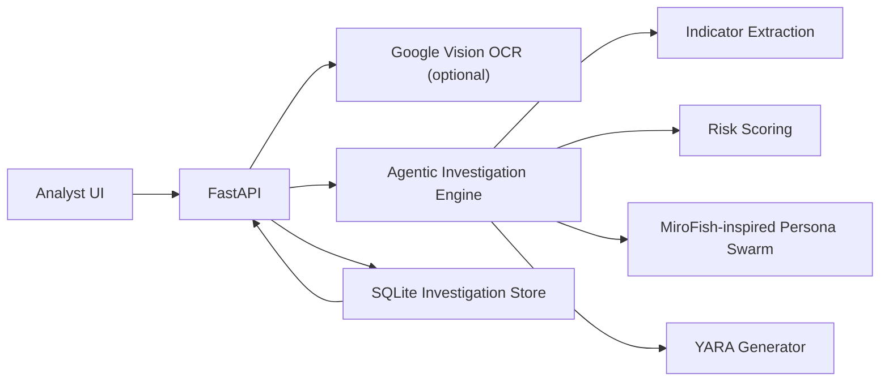

# Product Requirements Document: Darkweb Monitoring Agentic AI

## Source Basis

The attached 8-page PDF describes a Google Threat Intelligence investigation pattern:

- Traditional monitoring creates noise and false positives.
- Agentic AI should sift large dark-web event streams and align underground activity to an organization's unique risk profile.
- The example investigation starts with shell sales in the last 30 days.
- Initial findings identify PHP shells and cPanel access promoted on Telegram, with high-value `.gov` and `.edu` targets.
- Investigation pivots split into actor research, technical payload analysis, and financial breadcrumbs.
- Technical analysis identifies B374K, WSO, Base64 obfuscation, `.htaccess` modification, and cron-job persistence.
- The workflow generates YARA rules and supports Livehunt/Retrohunt-style validation.
- The strategic direction is greater autonomy: context, intent, and defensive innovation.

Public tooling considered:

- MiroFish public GitHub project: multi-agent prediction engine using graph construction, persona generation, simulation, and report generation.
- Google Cloud Vision: OCR for screenshots and scanned evidence that analysts may receive from closed sources, chat captures, or documents.

## Product Vision

Build a defensive, agentic dark-web monitoring product that turns noisy underground mentions into validated, asset-relevant intelligence. The product must help analysts move from raw mention to scoped investigation, detection engineering, and executive-ready reporting.

## Goals

- Reduce false positives by correlating underground mentions with organization context.
- Provide guided pivots across actor, technical, and financial paths.
- Generate immediately usable defensive artifacts such as YARA rules.
- Support OCR ingestion through Google Cloud Vision.
- Preserve reports, rationale, confidence, and evidence for audit.
- Provide a complete deployable baseline with API, UI, persistence, tests, CI, Docker, and documentation.

## Non-Goals

- No unauthorized crawling, purchasing, credential collection, exploit execution, or account compromise.
- No claim that generated YARA is production-final without validation.
- No hidden dependence on a proprietary threat-intelligence feed.

## Personas

- SOC analyst: needs high-signal alerts and investigation summaries.
- Threat intelligence analyst: needs pivots, actor/channel timelines, source context, and confidence.
- Detection engineer: needs payload traits and YARA/hunting content.
- Risk owner: needs asset relevance, impact, and recommended owner action.

## Core User Stories

- As an analyst, I can paste raw dark-web text and receive a structured report.
- As an analyst, I can choose scoping, actor, technical, or financial focus.
- As a detection engineer, I can generate YARA rules for PHP shell families.
- As a threat intel analyst, I can see recommended pivots for handles, payloads, domains, and crypto addresses.
- As a user with image evidence, I can send screenshots to Google Cloud Vision OCR and feed the text into an investigation.
- As a manager, I can retrieve stored investigations and review risk scoring and recommendations.

## Functional Requirements

1. Ingestion
   - Accept analyst-provided text through API and UI.
   - Accept image uploads through a Google Vision OCR endpoint when configured.
   - Reject OCR requests when credentials are not configured.

2. Indicator Extraction
   - Extract domains, high-value TLDs, handles, cryptocurrency addresses, shell families, obfuscation methods, persistence methods, and infrastructure tooling.
   - Assign confidence and evidence labels.

3. Agentic Analysis
   - Run a scoping agent to reduce noisy mentions into investigation themes.
   - Run an organization-context agent to align findings with business exposure.
   - Run a technical-analysis agent when payload or persistence traits appear.
   - Run a lightweight swarm simulation inspired by MiroFish persona-based analysis.

4. Risk Scoring
   - Produce a 0-100 risk score.
   - Increase score for web-shell families, `.gov`/`.edu` targeting, actor handles, crypto breadcrumbs, and persistence markers.

5. Pivot Guidance
   - Generate actor, technical, and financial pivot prompts.
   - Recommend correlation with owned assets and approved telemetry.

6. Detection Content
   - Generate distinct YARA rules for B374K and WSO when those families appear.
   - Generate a generic PHP web-shell rule when no specific family appears.
   - Include rationale and validation guidance.

7. Reporting and Persistence
   - Persist reports in SQLite.
   - Support listing and retrieving investigation reports.
   - Include executive summary, findings, indicators, pivots, rules, and next actions.

8. UI
   - Provide a production-style analyst console as the first screen.
   - Support seed text, organization profile, focus selection, YARA toggle, and swarm toggle.
   - Render reports without page refresh.

## Security and Compliance Requirements

- Treat the product as defensive-only tooling.
- Keep raw evidence inside approved retention boundaries.
- Store Google service account credentials outside the repository.
- Place production deployment behind SSO, TLS, audit logging, rate limits, and network controls.
- Validate generated detections before enforcement.

## Architecture

## Success Metrics

- Analyst can generate a report in under 10 seconds for pasted text.
- At least 90% of reports include pivots and next actions.
- Detection engineer can export generated rules without manual formatting.
- OCR endpoint returns clear configuration errors when Google Vision is not enabled.
- CI passes lint and tests on every push.

## Release Scope

Included in this implementation:

- FastAPI backend.
- Static production-style UI.
- SQLite storage.
- Google Vision OCR integration stub with real client support.
- Agentic analysis engine.
- YARA generation.
- Docker and Compose.
- CI workflow.
- Unit/API tests.

Future enhancements:

- STIX/TAXII export.
- MISP/OpenCTI integration.
- Google Threat Intelligence API integration, subject to licensed access.
- Full graph database for actor/channel/entity relationships.
- External YARA validation pipeline.
- MiroFish sidecar adapter for large-scale simulation when license and deployment boundaries permit.

